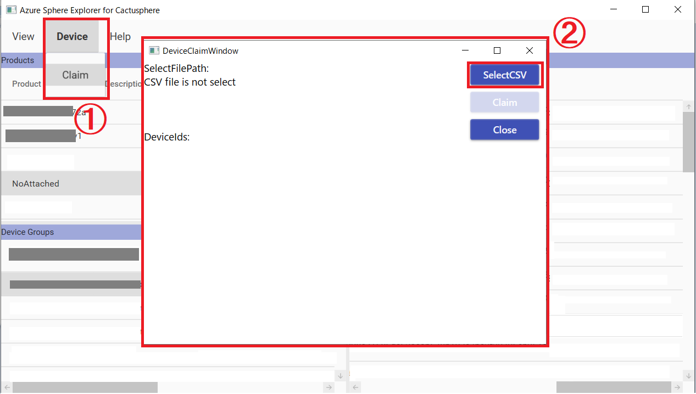

# AzureSphereExplorer

Azure Sphereのデバイスやプロダクト、デバイスグループなどをすばやく簡単に見ることができるツールとして、AzureSphereExplorerがあります。AzureSphereExplorerの詳細情報は[こちら](https://github.com/matsujirushi/AzureSphereExplorer)を参照してください。

アットマークテクノでは、AzureSphereExplorerをベースにして、以下の機能を追加したAzureSphereExplorerの実行ファイルを提供します。

## 追記機能一覧

- デバイスのクレーム (claim) 機能
- SphereOS/アプリのOTA保留/時間指定実行

## 要件

### サポートしているプラットフォーム

* Microsoft Windows 10 (.NET Framework 4.8)
* Microsoft Windows 10 (.NET 5)

## インストール方法

1. [AzureSphereExplorer_AT.zip](https://github.com/KMOGAKI/Cactusphere-100/raw/explorer_rc-1/Tools/AzureSphereExplorer/AzureSphereExplorer_AT.zip)をダウンロードしてください。
1. 適当なフォルダに、`AzureSphereExplorer_AT.zip`を解凍してください。
1. 解凍した中にある、`AzureSphereExplorer.exe`を起動してください。

## 使い方

## 追記機能の使い方

### デバイスのクレーム (claim) 機能

Azure Sphere テナントに接続できるようにするためには、Azure Sphere テナントにクレーム[^1] 作業を行ってテナントにデバイスを紐付ける必要があります。AzureSphereExplorerでは、一度、クレームして Azure Sphere テナントに紐付けられると、紐付けられた Azure Sphere テナントを**変更することはできない**ため、注意して実施して下さい。

[^1]: クレーム
クレームについての詳細についてはソフトウェアマニュアルを参照してください。ソフトウェアマニュアルのダウンロードには、Armadilloサイトのユーザー登録とログインが必要になります。
https://armadillo.atmark-techno.com/resources/documents/cactusphere/manuals

### AzureSphereExplorerからデバイスのクレーム (claim) を行う方法

AzureSphereExplorerの"Device"タブから"Claim"を選択すると、"DeviceClaimWindow"が表示されます。

"DeviceClaimWindow"の"Claim"ボタンを押下します。

"Attention"ウィンドウが表示され、クレームをしてよいか確認されます。**一度、クレームして Azure Sphere テナントに紐付けられると、紐付けられた Azure Sphere テナントを変更することはできないため、注意して実施して下さい。** 

問題ない場合は、「はい(Y)」ボタンを押下します。

問題なくクレームが実行されると、"Claim is finished."と記載されたウィンドウが表示されます。その際、"DeviceClaimWindow"の"deviceids"の"success"の下に、クレームしたデバイスのデバイスIDが表示されている事を確認します。問題がない場合、"OK"ボタンを押下してウィンドウを閉じます。

これでクレームは完了です。

### SphereOS/アプリのOTA保留/時間指定実行

Cactusphereはアップデート保留機能[^2]を有しています。この機能を用いる事で、OSとFWのOTAを遅延させる事ができます。

[^2]:アップデート保留機能
アップデート保留機能についての詳細についてはソフトウェアマニュアルを参照してください。
ソフトウェアマニュアルのダウンロードには、Armadilloサイトのユーザー登録とログインが必要になります。
https://armadillo.atmark-techno.com/resources/documents/cactusphere/manuals

### AzureSphereExplorerからOTA保留機能を利用する方法

AzureSphereExplorerの"Devices"ペイン内のデバイスID一覧から任意のデバイスを選び、 **右クリック** します。一覧から"Update Properties"を選択します。

"UpdatePropertiesWindow"が表示されます。この際、先ほど選択したデバイスIDがデフォルトで選択された状態になっています。

"CentralAppName:"に、＊＊＊の値を入力します。

"APIToken:"に、＊＊＊の値を入力します。

"FW Update Time"にはファームウェア、"OS Update Time"にはOSをアップデートする時間を設定する事ができます。

アプリケーションテンプレート作成時に、設定したタイムゾーンを指定できます。日本時間

この際、startの時間とendの時間を同じにすることはできません。

"Update"ボタンを押下して、アップデート保留機能を設定します。

＊＊＊＊が表示されます。""と表示された場合は、アップデート保留機能の設定に成功しています。

[画像]

これで、アップデート保留機能の設定は完了です。